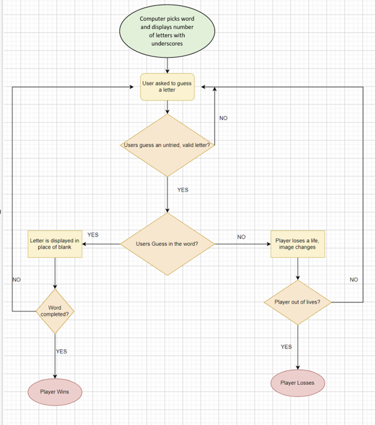

Welcome to Hangman,

This is a Python terminal version of Hangman. It runs in the Code Institute mock terminal. 

The User is given a certain amount of attempts to try guess letters in a hidden word picked by the computer.

You can read more about Hangman on [Wikipedia](https://en.wikipedia.org/wiki/Hangman_(game))

## How to Play

* The user starts with 6 livesThe Computer picks a word and displays blanks (_'s) to the user to signify the amount of letters in the word
* The User is then asked to try guess a letter that is in the word
* If the User's guess is in the word, the computer displays the letter (or letters if there are multiple instances) of the letter in place of the blanks. If it is not in the word, the user loses a life.
* The User keeps guessing until they have guessed all the correct letters (They win) or runs out of lives/attempts (They lose)

## Flow Chart for Hangman

1. `heroku/python`
2. `heroku/nodejs`

You must then create a _Config Var_ called `PORT`. Set this to `8000`

If you have credentials, such as in the Love Sandwiches project, you must create another _Config Var_ called `CREDS` and paste the JSON into the value field.

Connect your GitHub repository and deploy as normal.

## Constraints

The deployment terminal is set to 80 columns by 24 rows. That means that each line of text needs to be 80 characters or less otherwise it will be wrapped onto a second line.

-----
Happy coding!

## Acknowledgements 
* https://wtools.io/convert-list-to-json-array for converting lists to json format
* https://www.britannica.com/topic/list-of-countries-1993160 for list of countries
* https://www.theguardian.com/news/datablog/2012/nov/04/uk-million-selling-singles-full-list#data for song list
* https://www.imdb.com/list/ls055592025/ for film list
* https://www.randomlists.com/ for random list of words
* https://en.wikipedia.org/wiki/List_of_best-selling_books for list of books