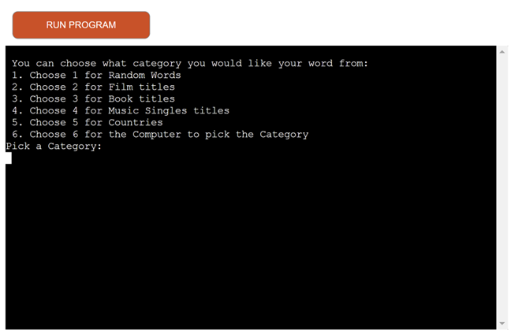
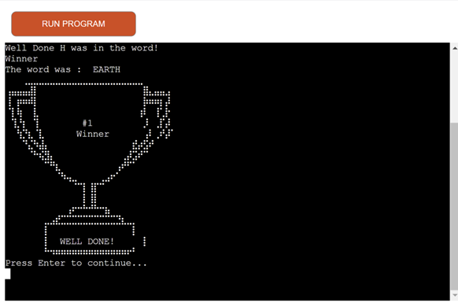
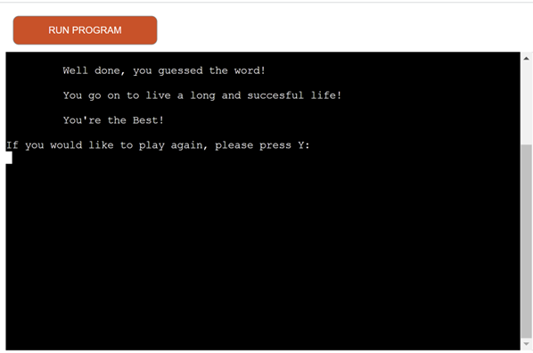

<h1>Welcome to HANGMAN</h1>

This is a Python terminal version of [Hangman](https://forgottenit-hangman.herokuapp.com). It runs in the Code Institute mock terminal. 

The User is given a certain amount of attempts to try guess letters in a hidden word picked by the computer.

You can read more about Hangman on [Wikipedia](https://en.wikipedia.org/wiki/Hangman_(game))

## How to Play

* At the Loading screen the User is asked to press Enter, then thr rules are displayed
* The user is asked to choose a category, these are either : Words, Songs (Singles), Films, Books or Countries. Or the user can let the computer pick the category.
* The user is then shown the background story for their category. The user then decides if they want to play Easy (10 lives), Medium (8 lives) or Hard (6 lives)
* The Computer picks a word from the chosen category and displays blanks (_'s) to the user to signify the amount of letters in the word. If the word contains symbols such as hyphens or numbers (1,2,3 etc.) These are displayed to the user. If it's roman numerals (i.e. I or V etc.) These are not displayed. 
* The User is then asked to try guess a letter that is in the word. The input will only allow lettera to be attempted. It also will tell the user if they've already attempted the letter.
* If the User's guess is in the word, the computer displays the letter (or letters if there are multiple instances of the letter) in place of the blanks. If it is not in the word, the user loses a life.
* The User keeps guessing until they have guessed all the correct letters (They win) or runs out of lives/attempts (They lose)
* After the game they are shown the corresponding End story, and asked if they want to play again, if they enter "Y" the game reverts back to the category choice, any other input leads back to the intro image

## Flow Chart for Hangman

## Design

* The Intro Art is to display to the User the Game, ASCII Art was used for visual appeal.

* Rules are then displayed to the user to explain how the game will work.

* Categories are then offered to the user to pick from, the user can also have the computer select the category, this is so the user will know where the word comes from i.e. Film titles, Book titles etc. to add some variety to the game.

* Each Category has its own introduction and end story, this is to add a bit more fun for the user and variety.

* Each Category in the game has its own ASCII Art relative to the category, Random words is the typical Hangman image, Countries is a picture of the Earth, Songs is music notes etc. Again, this is to add variety and replayability. The Blanks are also spaced out so the user can see how many letters the word contains and the remaining lives are also displayed.

* The Game displays a message to you user saying they guessed correctly and also the letter in it's correct place, replacing the underscore. It also displays to the user the letters they've already picked and which ones were correct.

* The Game displays a message once an incorrect letter is inputted, saying this was incorrect and adds that letter to the list of letters the player has already picked. 

* If the player Guesses the correct word a trophy is displayed to the User using ASCII Art.

* The player is then shown the end of the category Story, dependent on the category they chose and how they did. If they failed to get the word, they are given a different story. They are then asked if they would like to play again, if so (By Entering y) they go back to Category selection, everything else brings them back to the intro screen.

## Technology used

1. GitPod for writing the code
2. Python as the programming language
3. Heroku for deployment
4. Code Instistute Terminal for displaying finished product

## Imports used from Python Library
* import random - Used to allow the computer to randomly pick a category if that is the choice the user has made and also to randomly pick the word from choices available
* import re - Used to search the word as a string to see if it still contains letters (in case it just contains characters or numbers)
* import importlib - Used to import modules dynamically, once the user has chosen their category
* import os - Used for the "Clear Screen" function, to check what Operating System the user is using so the appropriate clear method can be used (i.e. "clear" or "cls")

## Testing

1. Testing involved using pylint on all the .py modules by running pylint in the terminal, where all code reached 10 out of 10.

2. Testing also involved [CI Python Linter](https://pep8ci.herokuapp.com/) with Results returning All Clear, no errors found.

3. Testing also involved Practical testing, this was ongoing throughout the project, both in the Terminal and then on the deployed app. This was to ensure all the input gave the expected results, the links worked, that it deployed correctly on the Code Institute Terminal etc. Testing also involved ensuring that symbols (i.e. commas, apostrophes, hyphens etc.) were displayed to the user. Also, ensuring that if the correct letter was entered, all instances of the letter were filled in. All letters are converted to uppercase also, so the game is not case sensitive.

- 

- 

- 

## Constraints

* The deployment terminal is set to 80 columns by 24 rows. That means that each line of text needs to be 80 characters or less otherwise it will be wrapped onto a second line.
* A "\n" symbol had to be inserted at the end if user input print outs due to a quirk in the terminal interface.

## Deployment
<h3>GitPod<h3>

* To deploy in GitPod load from the GitHub repository, then enter "Python3 run.py" in the main terminal

<h3>Heroku</h3>
1. Go to the Heroku Dashboard and Click "New" in the top right corner then click "Create new app"

  

2. Name the App and set the region to Europe

  

3. Go to Settings and, Click Reveal Config Vars and set keys to PORT and value to 8000

  

4. Click Add Buildpacks, add Python, save changes.

  

  

5. Repeat step 4, but this time add Node.js, once completed it should look like below, with heroku/python above herokue/node.js, if now they can be clicked upon and dragged to change to this order.

  

6. Navigate to the Deploy section. Select GitHub from the Deployment Method section, connnect your GitHub Repo by selecting the repo name (in this case, hangman) and Authorise when prompted.

  

  

  

7. Click Enable Automatic Deploys. Once Changes are pushed to your repo, the app will be constucted.

  

8. Finally, click Open App to run the App in the Code Institute Terminal

  

## Acknowledgements 
* https://wtools.io/convert-list-to-json-array for converting lists to json format
* https://www.britannica.com/topic/list-of-countries-1993160 for list of countries
* https://www.theguardian.com/news/datablog/2012/nov/04/uk-million-selling-singles-full-list#data for song list
* https://en.wikipedia.org/wiki/AFI%27s_100_Years...100_Movies for film list
* https://www.randomlists.com/ for random list of words
* https://en.wikipedia.org/wiki/List_of_best-selling_books for list of books
* https://www.scaler.com/topics/how-to-clear-screen-in-python/ for info on how to Clear User Screen depending 
  on operating System 
* https://emojicombos.com/fire-ascii-art AND https://asciiflow.com/ ASCII Art